# Our Games

## Six ways to suffer

Buckshot Roulette with different types of bullets

[Repo](https://github.com/100-Devs-1-Game/Sixwaystosuffer) | [itch.io](https://100devs.itch.io/six-ways-to-suffer) | [Discord](https://discord.com/channels/1393033395298373643/1413078236203716618)

## Dragon Dragon Fire Fire

8-bit arcade platformer where the level can catch fire and collapse

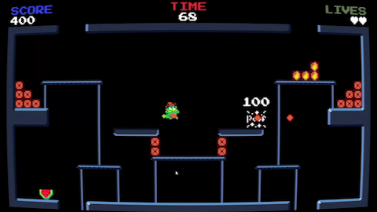

[Repo](https://github.com/100-Devs-1-Game/DragonDragonFireFire) | [itch.io](https://100devs.itch.io/dragon-dragon-fire-fire) | [Discord](https://discord.com/channels/1393033395298373643/1418607460998058186)

## Flight of Harmony

MLP-themed Learn-to-Fly clone

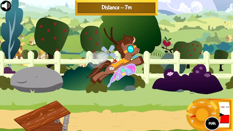

[Repo](https://github.com/100-Devs-1-Game/FlightOfHarmony) | [itch.io](https://100devs.itch.io/flight-of-harmony) | [Discord](https://discord.com/channels/1393033395298373643/1417325149237018778)
 | [Game Design Document](https://docs.google.com/document/d/1LwxXLI24cQgxQXptIqzGMn9nKDVGqlArX3q4io6jo5Y/view)

## Paper Town

Paper Mario inspired Open World with turn based rpg combat

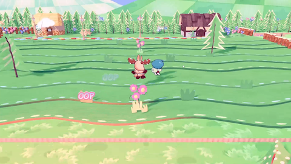

[Repo](https://github.com/100-Devs-1-Game/PaperTown) | [itch.io](https://100devs.itch.io/paper-town) | [Discord](None)
 | [Game Design Document](https://docs.google.com/document/d/1kVX0mqqk9Km9ySKHk8CYTFbhVSoLgE-GDvlytgr337A/view)

## The Typing Experiment

Typing practice game with PSX asset pack

[Repo](https://github.com/100-Devs-1-Game/TheTypingExperiment) | [itch.io](https://100devs.itch.io/the-typing-experiment) | [Discord](https://discord.com/channels/1393033395298373643/1422824881963270184)

## A Moth's Reprise

Hollow Knight inspired arena sidescroller

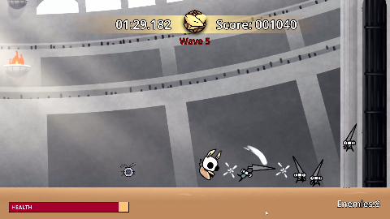

[Repo](https://github.com/100-Devs-1-Game/Mothinpurgatory) | [itch.io](https://100devs.itch.io/moth-in-purgatory) | [Discord](https://discord.com/channels/1393033395298373643/1412126365037363223)

## The Full Picture

Detective game in an art museum

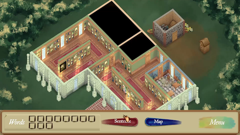

[Repo](https://github.com/100-Devs-1-Game/TheFullPicture) | [itch.io](https://100devs.itch.io/the-full-picture) | [Discord](https://discord.com/channels/1393033395298373643/1430691437468582110)
 | [Game Design Document](https://docs.google.com/document/d/1QONQPdCTbZk50JTa_6FefzufwRDuonxn7PdqiAQjMGs/view)

## Mental Record

Mysterious point-and-click deduction game

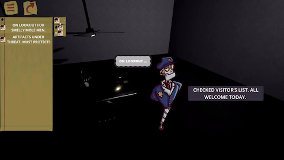

[Repo](https://github.com/100-Devs-1-Game/MentalRecord) | [itch.io](https://100devs.itch.io/mental-record) | [Discord](https://discord.com/channels/1393033395298373643/1434576625781182626)
 | [Game Design Document](https://docs.google.com/document/d/13JczpgkgP_jXjXfqlM79GeA-BvbkYD_awCTDMjoE_r4/view)

## Wobble Wings

Flappy bird meets Celeste & Spyro

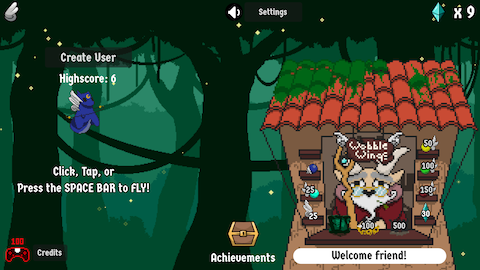

[Repo](https://github.com/100-Devs-1-Game/WobbleWings) | [itch.io](https://100devs.itch.io/wobble-wings) | [Discord](https://discord.com/channels/1393033395298373643/1413386816056197140)

## Mossy March Defense

Tower Defense ala System Defender

[Repo](https://github.com/100-Devs-1-Game/MossyMarchDefense) | [itch.io](https://100devs.itch.io/mossy-march-defense) | [Discord](https://discord.com/channels/1393033395298373643/1426665162433364042)

## 8bit Pony

Early 8-bit 2d sidescroller shooter

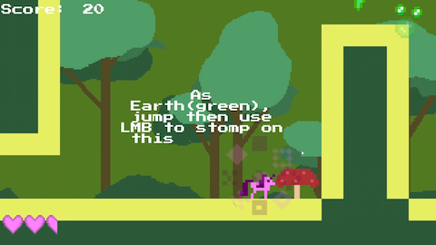

[Repo](https://github.com/100-Devs-1-Game/8bitPony) | [itch.io](https://100devs.itch.io/8bit-pony) | [Discord](https://discord.com/channels/1393033395298373643/1425625258160951438)
 | [Game Design Document](https://docs.google.com/document/d/1Ocz9ifRRSWqYJpE7yCC1FIftcr9dXGPrGB_QTutRMyM/view)

## Critter Catchin'

I-spy game

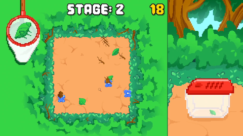

[Repo](https://github.com/100-Devs-1-Game/CritterCatchin) | [itch.io](https://100devs.itch.io/critter-catchin) | [Discord](https://discord.com/channels/1393033395298373643/1428577981256699995)

## Bouncing Boat - The Seagull Slayer

Bounce your boat on the waves to kill seagulls

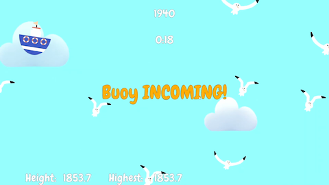

[Repo](https://github.com/100-Devs-1-Game/WavePrototype) | [itch.io](https://100devs.itch.io/bouncing-boat) | [Discord](https://discord.com/channels/1393033395298373643/1419015923985154068)

## Adorable Aliens

Nom-cat-clone

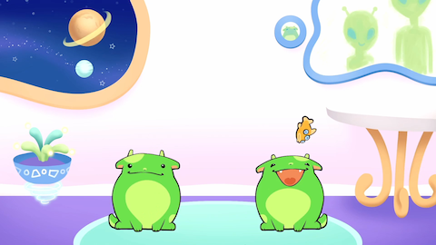

[Repo](https://github.com/100-Devs-1-Game/NomCatClone) | [itch.io](https://100devs.itch.io/adorable-aliens) | [Discord](https://discord.com/channels/1393033395298373643/1434794198497890347)

## Beezkrieg

Mobile fortress game

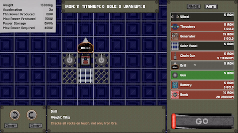

[Repo](https://github.com/100-Devs-1-Game/MobileBaseDefender) | [itch.io](https://100devs.itch.io/mobile-fortress) | [Discord](https://discord.com/channels/1393033395298373643/1431166777337057371)

## KYRO

Parkour/Infinite Runner/Surfing-Shooter

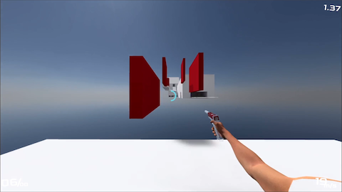

[Repo](https://github.com/100-Devs-1-Game/KYRO) | [itch.io](https://100devs.itch.io/kyro) | [Discord](https://discord.com/channels/1393033395298373643/1412483564401856567)

## Pocket Turtle

Virtual Pet for your desktop

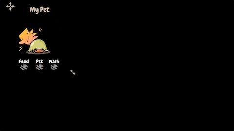

[Repo](https://github.com/100-Devs-1-Game/PocketTurtle) | [itch.io](https://100devs.itch.io/pocket-turtle) | [Discord](https://discord.com/channels/1393033395298373643/1430695178192293960)

## Creepy Crawlin'

Goth-themed vertical climbing platformer

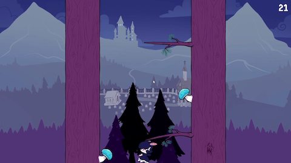

[Repo](https://github.com/100-Devs-1-Game/BabyBatClimber) | [itch.io](https://100devs.itch.io/baby-bat-climber) | [Discord](https://discord.com/channels/1393033395298373643/1430690834923389051)

## The Hatchery

Clicking game where you're trying to incubate a viable and living homunculus.

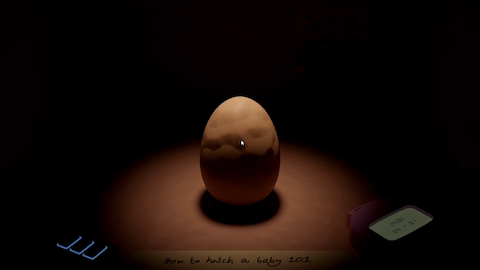

[Repo](https://github.com/100-Devs-1-Game/TheHatchery) | [itch.io](https://100devs.itch.io/the-hatchery) | [Discord](https://discord.com/channels/1393033395298373643/1432367877570302065)

## Beware the Living Room

Inspired by the minigame in Resident Evil Biohazard where the player needs to solve puzzles in order to escape

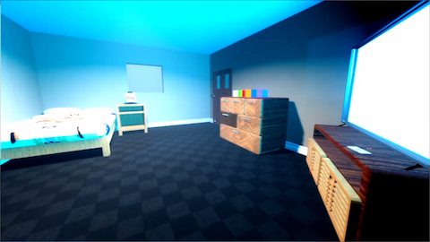

[Repo](https://github.com/100-Devs-1-Game/BewareTheLivingRoom) | [itch.io](https://100devs.itch.io/beware-the-living-room) | [Discord](https://discord.com/channels/1393033395298373643/1417013855388696606)

## Road to Nowhere

Deck-builder meets City-builder

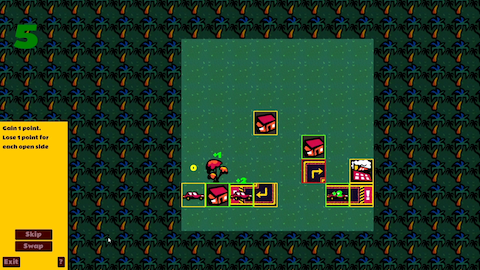

[Repo](https://github.com/100-Devs-1-Game/RoadToNowhere) | [itch.io](https://100devs.itch.io/road-to-nowhere) | [Discord](https://discord.com/channels/1393033395298373643/1418006583824355408)

## Asteroid farming

Voxel Farming game in space

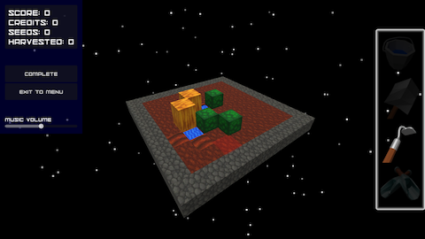

[Repo](https://github.com/100-Devs-1-Game/AsteroidFarming) | [itch.io](https://100devs.itch.io/asteroid-farming) | [Discord](https://discord.com/channels/1393033395298373643/1426518019198288077)

## Run Rabbit Run Run Run

A looped endless runner where the speed increases

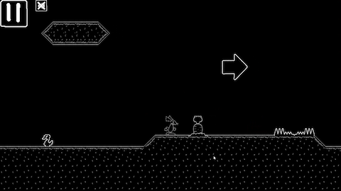

[Repo](https://github.com/100-Devs-1-Game/JumpAndRunAndAgain) | [itch.io](https://100devs.itch.io/run-rabbit-run-run-run) | [Discord](https://discord.com/channels/1393033395298373643/1422404772555784242)
 | [Game Design Document](https://docs.google.com/document/d/1McAHQA3Ubm0eEgBjcZimVnr8toZV7ZETXuyATMhHz0g/view)

## In the Clouds

Vertical climbing platformer with wind physics

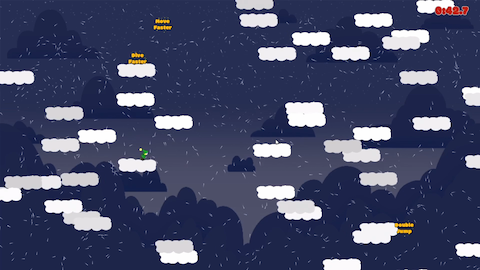

[Repo](https://github.com/100-Devs-1-Game/InTheClouds) | [itch.io](https://100devs.itch.io/in-the-clouds) | [Discord](https://discord.com/channels/1393033395298373643/1412117757008285796)

